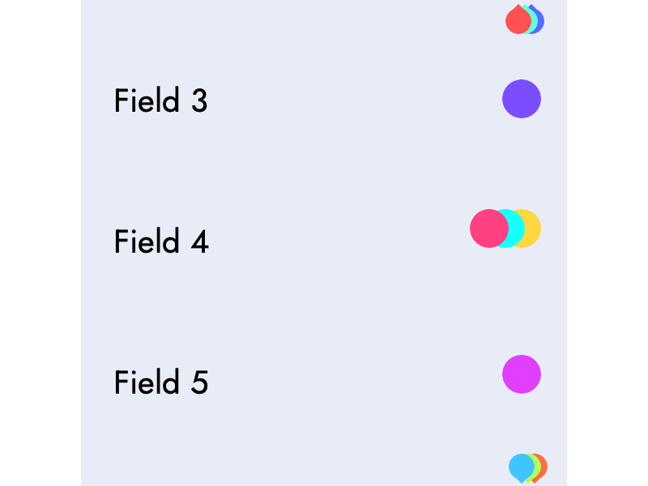

You can play with this on the [Demo App](https://alice-sanity-ava.netlify.app/). The avatars on the fields are randomly generated so you may have to refresh a few times to get one with more active users.

# Goal
Architect a presence UI for a content editor, where you can see who else is on which fields. For fields not on the screen (above/below page fold), users presence is hinted at with a location marker.

# Assumptions

Before we proceed, some assumptions made to narrow scope are:
- Form fields doesn't change, when the page is opened (maybe it will change onload)
- We don't have tons of users (>20) looking a field
- Users can: change their focus field, leave page, enter page
- Users who are not focused on any field are not visible

# Architecture

Our React app is structured with the following components:

[App](src/App.js)

> [FoldPreview](src/FoldPreview.js) (above)
> > list of [Avatar](src/Avatar.js) shows users on fields above the fold

> list of [FieldRow](src/FieldRow.js) each row has a label, list of users focused on it, and an input field
> > list of [Avatar](src/Avatar.js) shows users on the field. There is a wrapper aroudn the avatars, which is attached to an intersection observer to determine if the avatars on this field are within viewport.

> [FoldPreview](src/FoldPreview.js) (below)
> > list of [Avatar](src/Avatar.js)  shows users on fields below the fold

Listener of the intersection observer is in App, which keeps track of field rows below & above the fold. It also tries to figure out which avatars in `FoldPreview` are about to pop back into their home position when their field becomes visible. Inside App is also a listener to keep track of scroll direction.

The [Controller](src/Controller.js) component, which is a wrapper around App, is here to mock server's push messages. It naively shuffles users around the fields to simulate actual users moving around the page. In a real world environment, App will probably get its field props from a global state manager, which will be updated by the middlewear binding backend updates to global state.

# Approach

## 1. Implement on screen detection with Intersect Observer

I always approach a problem by figuring out the uncertainties. For this exercise, it was using [Intersect Observer](https://developer.mozilla.org/en-US/docs/Web/API/Intersection_Observer_API) that was new to me. After mocking out the data and rendering it on screen. I attached a wrapper around the avatars (`div.presence`) in the fields to a ref, and added them to the interesection observer. The intersection observer [runs on first render](src/App.js#L44) to populate an FoldPreview with avatars. Whenever the avatars in a FieldRow will come into view or scroll out of view it will notify the observer.

When the [observer gets notified it checks](src/App.js#L63) to see if it will need to update in state. If the state is updated, then upon re-render avatars will be added/removed from FoldPreview at the top/bottom right. 

## 2. Mock users moving around

Now that we have some we the problem of figuring out how to update with avatars in FoldPreview solved. Let's move on the second requirement of updating our view when users on the apge change focus to another field.

With a backend we'll recieve calls and updates state. But I didn't want to make another codebase or deal with websockets to listen for changes. So I just faked it in [Controller.js](src/Controller.js).

It has a list of fields and a list of users in its state. At [initalization](src/Controller.js#L36) it goes through the fields and randomly assigns 0-3 users to it, keeping a track of remaining unassigned users along the way, so we don't have the same user in two places.

At every 45 seconds, it [reshuffles](src/Controller.js#L52) some fields by either adding an unassigned user to the field or removing a user and putting them in the unassigned list. A more performant way of doing this would be to put it in a webworker, so it will be in its own thread.

After mocking this behavior, I also found some avatars online, fixed up the style of the page as well.

## 3. Animate transitions

There are two transitions we want to consider animating:
- When user unfocus/focus into a field
- When a avatar from the FoldPreview moves to its home position (field becomes visible).

For the unfocused/focus field case, since the majority of pixel movement is moving left and right. It would make sense for the animation change widths. I imported the [Transitions Group](https://github.com/reactjs/react-transition-group) library to help shrink, with `transform:scaleX` or `width`. But it seemed that the animations are more jarring and avatars just appearing/disappearing. So I undid those changes and moved on.

For the above/below fold animations, I wanted something similar to this:

It will hint that some of the avatars are about to return to home position. For this we need to track 2 things: intersection ratio and scroll direction.

Up into this point our intersection observer has been operating in binary. With an intersection threshold set to 1.0, we are aware if avatar group is in view or not. But in our state-based render framework, we need to know when to it's about to pop into home base, and apply the corresponding CSS classes to animate. We need to have knowledge of when it's in an in-between state. Turns out we can pass an array of ratios into the thresholds option, and the listener will run everytime one of the thresholds has been reached. By changing my observer's options `threshold : [0.5, 0.8, 1.0]`, the listener will now know if it's in one of those inbetween states. 

At >= 0.5, an avatar in FoldPreview will start bouncing to hint that it may be about to return to home position. At >= 0.8 it will expand to the size of a home-position avatar and hide its little pointer arrow. Then finally disappear from FoldPreview at 1.0 and the avatar will be visible in the home position field. Fyi, since the duration of all these animations is rather short to not distract from reading/writing work flow, the animations are only noticable if you are scrolling very slowly. If you are scrolling very fast up and down the page, they will just pop into place.

One bug we still have is that Intersection Observer gives us no information of the user's scroll direction. You may be scrolling down, and it just so happens that there's an field in the above FoldPreview that happens to be >= 0.5, the avatar from above will bounce. We want to track user behavior so to predict if we should even set the avatar to animate or not. I added a simple onScroll the detection to track the scrollY direction, only when we are scrolling down does the below-fold avatars have a chance of animating. And only when we are scrolling up will the above-fold avatars bounce.

## 4. Clean up & Componentize

Up until this point everything was in the App component. I didn't want to abstract too early and give myself more busy work of having to pass data (possibly the wrong data) up and down. After I got everything working, I broke it down. I abstracted the logic & css classes for the above/below fold groups into `FoldPreview`. Each field is now in its own `FieldRow` component, and passed the `observer` as a prop, so it can attach itself to the avatars wrapper (`div.presence`). 
